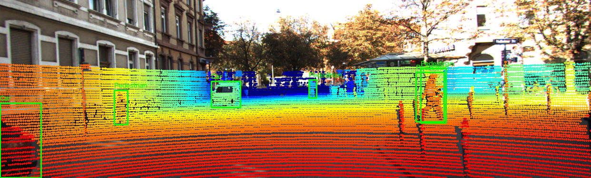
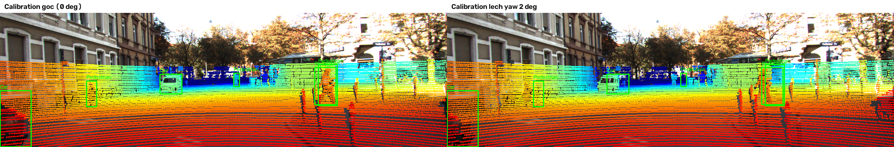

# Báo cáo Day 6: Độ nhạy của phép chiếu với lệch yaw

> Thay **mọi** ô có chữ ĐIỀN nằm trong ngoặc vuông bằng nội dung của bạn, xoá luôn cả dấu ngoặc vuông. Lệnh `python tools/check_submission.py` sẽ báo FAIL nếu còn sót bất kỳ chỗ nào.

- **Họ tên:** Vũ Quốc Huy
- **MSSV:** 2A202602929
- **Lớp:**
- **Link repo:** https://github.com/VuQuocHuy89/day06-2A202602929
- **Topic:** A — LiDAR-camera projection QA
- **Dataset:** data/kitti_mini
- **Các frame đã dùng:** 000008, 000011, 000049 (benchmark); 000019, 000011, 000004 (demo)

> Hãy viết ngắn: mỗi mục từ 3 đến 8 dòng, ưu tiên số liệu và hình ảnh.

## 1. Claim

Một câu khẳng định kỹ thuật có thể kiểm chứng. Ví dụ: *"Lệch yaw 1° làm 12% điểm LiDAR rơi ra khỏi vật thể ở 30 m, phát hiện được bằng edge-alignment score với ngưỡng X."*

Trên frame KITTI 000011, lệch yaw 2° làm tỷ lệ điểm thuộc người/vật thể trong khung 2D giảm từ 99.4% xuống 45.4%; riêng pedestrian giảm từ 99.7% xuống 21.2%.

## 2. Evidence

Bảng hoặc plot số liệu, kèm ảnh/video demo. Ghi rõ đường dẫn file trong `results/`.

| Cấu hình / mức perturb | Metric 1 | Metric 2 | Ghi chú |
|---|---|---|---|
| KITTI yaw 0/0.5/1/2/3° | Frame 000011: 99.4/91.9/77.4/45.4/21.2% | Frame 000008: 99.6/99.6/98.6/94.8/91.0%; 000049: 99.3/97.5/93.5/84.7/74.3% | [CSV](../results/topic_a_yaw_sweep.csv), [plot](../results/figures/topic_a_yaw_sweep.png) |



[B2] Stress test trên ba frame KITTI dùng random dropout giữ 90/70/50% điểm và Gaussian noise σ=0.02/0.05/0.10 m. Object-point support lần lượt còn 89.8/70.4/49.9% với dropout và 97.9/92.3/83.3% với noise; box hit ratio tương ứng là 99.5/99.5/99.4% và 99.5/99.2/99.2%. [CSV](../results/topic_a_stress.csv), [biểu đồ](../results/figures/topic_a_stress_test.png).

[B3] Đo pipeline trên frame 000011 với năm mức yaw trong 21 lần chạy; bỏ lần warm-up đầu khi tính percentile. p50=238.62 ms, p95=449.36 ms trên Intel Core i5-7300U 2.60 GHz, RAM 15.5 GB; GPU không được phát hiện và không dùng. [CSV latency](../results/topic_a_latency.csv).

[B5] Chạy cùng yaw sweep trên KITTI (000008, 000011, 000049) và nuScenes (scene-1094_000, _007, _008; cảnh đêm sau mưa). Hit ratio gộp tại yaw 0/1/2° lần lượt là 99.5/95.0/87.4% và 100.0/95.4/88.7%, gần nhau trên các frame đã chọn. KITTI dùng LiDAR 64 beam, có khoảng 108–123 nghìn điểm/frame, ảnh 1242×375 và fx=721.5 px; nuScenes dùng 32 beam, khoảng 34 nghìn điểm/frame, ảnh 1600×900, fx=1266.4 px và lệch timestamp khoảng 35–38 ms đã được bù ego-motion. Lưu ý adapter nuScenes tạo 2D box bằng cách chiếu 3D annotation, nên hit ratio 100% tại yaw 0° không phải nhãn độc lập; khác biệt còn chịu ảnh hưởng của mật độ điểm, tiêu cự, box và cảnh, không suy rộng cho toàn dataset. [CSV](../results/topic_a_dataset_compare.csv), [biểu đồ](../results/figures/topic_a_dataset_compare.png).

## 3. Failure case

Nêu khi nào hệ thống hoặc phương pháp fail, vì sao fail, và liên hệ tới lớp nào trong 6 lớp debug: I/O, Geometry, Time, Preprocess, Model, Metric.



Ở frame 000011, khi lệch yaw 2°, chỉ 21.2% điểm thuộc pedestrian còn nằm trong 2D box; khi calibration đúng là 99.7%. Overlay cho thấy điểm LiDAR trượt khỏi box nhãn cố định. Nguyên nhân thuộc Geometry: extrinsic yaw sai. Khi triển khai, chạy kiểm tra alignment trên cảnh chuẩn và cảnh báo nếu hit ratio pedestrian dưới 80% liên tiếp; cần hiệu chỉnh ngưỡng trên nhiều cảnh trước khi dùng thật.

## 4. Khuyến nghị nếu triển khai thật

Use-case cụ thể (ADAS / robot / drone), trade-off và bước tiếp theo.

Với ADAS, kiểm tra alignment khi xe dừng tại khu vực chuẩn hoặc trong quy trình bảo dưỡng để tránh tốn thời gian xử lý khi xe đang chạy. Theo dõi hit ratio theo lớp và khoảng cách, đồng thời lưu yaw hiệu chuẩn và số frame dưới ngưỡng; dùng ngưỡng ban đầu 80% cho pedestrian rồi xác nhận lại trên nhiều điều kiện đường.

## 5. Cách chạy lại

Các lệnh tái tạo lại toàn bộ kết quả từ repo sạch.

```bash
python -m src.test_projection
python -m src.topic_a --data-root data/kitti_mini --frames 000008 000011 000049 --yaw-levels 0 0.5 1 2 3
python -m src.topic_a_bonus --help
python -m src.topic_a_bonus
```

[B4] `src/topic_a_bonus.py` có tham số CLI kèm help, giá trị mặc định và chạy không tham số để tạo stress test, latency, so sánh dataset cùng các file bằng chứng trong `results/`.

## 6. Khai báo sử dụng AI

Ghi rõ đã dùng công cụ AI nào, dùng vào việc gì, và bạn đã tự kiểm chứng kết quả đó bằng cách nào. Nếu không dùng AI, ghi "Không sử dụng". Xem quy định ở `RULES.md` mục 2.

| Công cụ | Dùng cho việc gì | Bạn đã kiểm chứng thế nào |
|---|---|---|
| ChatGPT/Codex | Giải thích yêu cầu và hỗ trợ viết phép chiếu, benchmark, bonus, báo cáo | `python -m src.test_projection` và checker đều qua; stress test dùng seed cố định; các số liệu được tạo lại từ script trên các frame đã nêu |
